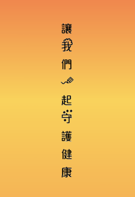
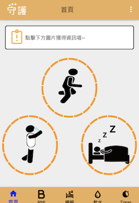
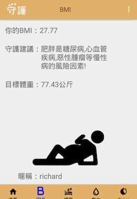
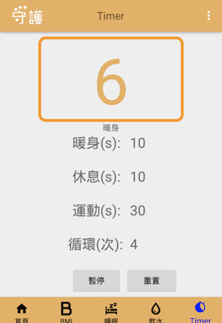

# Shouhu App

## Target

- Implement the MVP project about the Android app to practice.
- Purpose:
  - Design the app to record healthy circumstances and notice users care about this.
- Target Audience 
  - The person who wants to be change
  - The person who wants to manage the life
  - The person who wants to write the note

## Language & Tool

- JAVA
- Android Studio

## Layout

- Login / Logout
- Homepage
- BMI
- Sleep
- Water

- Timer
- Dialog for a notice time

## Function:
- Swipe to other pages (Viewpager + Fragment + Navigation bar)

- CRUD for user's habit (SQLite)

- Export BMI and target weight (use BigDecimal class)
- Store the login data (SharedPreference)
- Design dialog (Inflate layout)
- Notification
- Timer (TimerTasks / Handle)
- Sound (SoundPool)
- Sleepy history record (Listview + SQLite)
- Custom time setting (Notification + Alarm Manager)

## Google play

- [Google play link](https://play.google.com/store/apps/details?id=com.jfmamjjasond.shouhu)

- ScreenShot

  